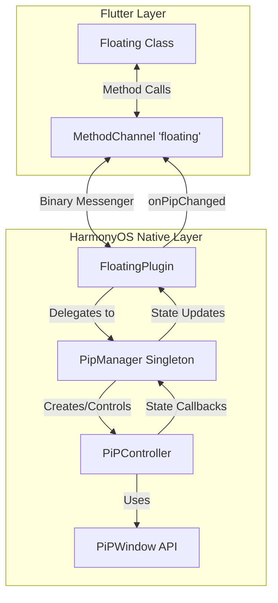
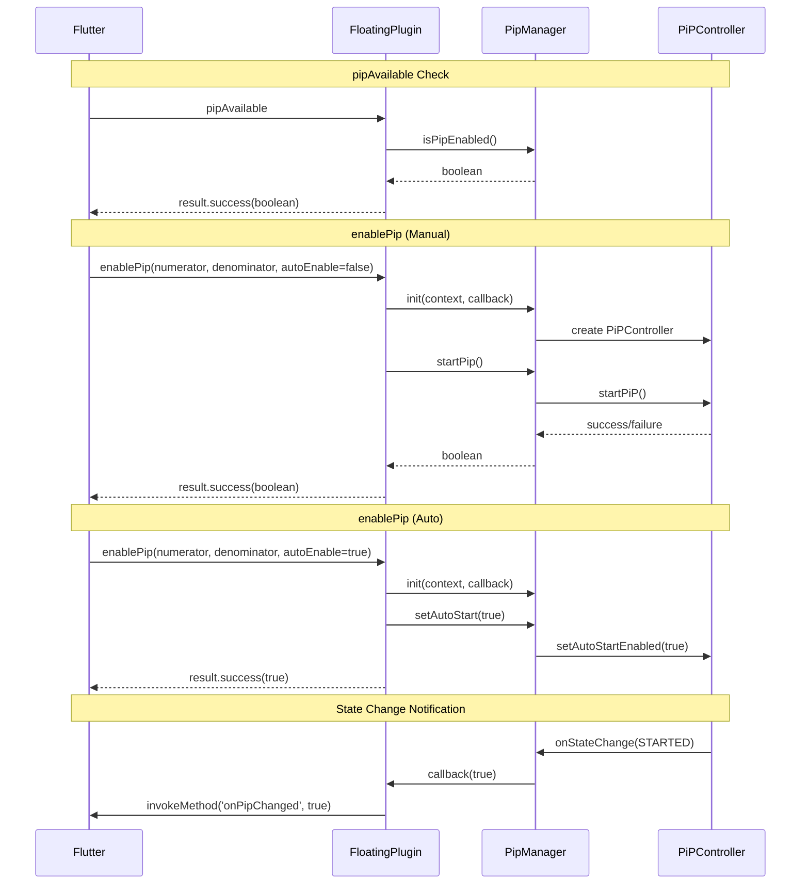

# Design Document

## Overview

This design document describes the architecture and implementation approach for adapting the Flutter floating (Picture-in-Picture) plugin to support HarmonyOS. The implementation will extend the existing `FloatingPlugin.ets` file to handle PiP operations using the HarmonyOS `PiPWindow` API, mirroring the functionality provided by the Android implementation.

The plugin will communicate with Flutter via MethodChannel, handling three main operations: checking PiP availability, enabling PiP mode (manual or automatic), and checking current PiP status. State changes will be communicated back to Flutter through method invocations.

## Architecture



The architecture follows a layered approach:
1. **Flutter Layer**: The existing `Floating` class communicates via MethodChannel
2. **Plugin Layer**: `FloatingPlugin` handles method calls and delegates to PipManager
3. **Manager Layer**: `PipManager` singleton manages PiPController lifecycle and state
4. **System Layer**: HarmonyOS PiPWindow API provides native PiP functionality

## Components and Interfaces

### FloatingPlugin (Enhanced)

The main plugin class that implements `FlutterPlugin` and `MethodCallHandler`.

```typescript
interface FloatingPlugin {
  // Lifecycle methods
  onAttachedToEngine(binding: FlutterPluginBinding): void
  onDetachedFromEngine(binding: FlutterPluginBinding): void
  
  // Method call handler
  onMethodCall(call: MethodCall, result: MethodResult): void
  
  // Internal state
  channel: MethodChannel | null
  context: Context | null
  pipManager: PipManager | null
  isInPipMode: boolean
}
```

**Supported Method Calls:**
- `pipAvailable`: Returns boolean indicating PiP support
- `enablePip`: Enables PiP with configuration (aspectRatio, autoEnable)
- `inPipAlready`: Returns current PiP state

### PipManager (New Component)

A singleton class that manages the PiPController lifecycle.

```typescript
interface PipManager {
  // Singleton access
  static getInstance(): PipManager
  
  // Initialization
  init(ctx: Context, onStateChange: (isInPip: boolean) => void): void
  
  // PiP operations
  startPip(): Promise<boolean>
  stopPip(): void
  setAutoStart(enabled: boolean): void
  updateContentSize(width: number, height: number): void
  
  // State
  isPipEnabled(): boolean
  isInPipMode(): boolean
  
  // Cleanup
  destroy(): void
}
```

### Method Call Flow



## Data Models

### PiP Configuration

```typescript
interface PipConfig {
  contentWidth: number   // Default: 1920 (from aspect ratio)
  contentHeight: number  // Default: 1080 (from aspect ratio)
  templateType: PiPWindow.PiPTemplateType  // VIDEO_PLAY for general use
}
```

### Method Call Arguments

**enablePip arguments:**
```typescript
{
  numerator: number      // Aspect ratio numerator (default: 16)
  denominator: number    // Aspect ratio denominator (default: 9)
  autoEnable: boolean    // Whether to auto-enter PiP on background
  sourceRectHintLTRB?: number[]  // Optional source rect hint [left, top, right, bottom]
}
```

### PiP State Mapping

| HarmonyOS PiPState | Plugin State | Flutter Notification |
|-------------------|--------------|---------------------|
| ABOUT_TO_START | - | - |
| STARTED | isInPipMode = true | onPipChanged(true) |
| ABOUT_TO_STOP | - | - |
| STOPPED | isInPipMode = false | onPipChanged(false) |
| ABOUT_TO_RESTORE | - | - |
| ERROR | isInPipMode = false | onPipChanged(false) |


## Correctness Properties

*A property is a characteristic or behavior that should hold true across all valid executions of a system-essentially, a formal statement about what the system should do. Properties serve as the bridge between human-readable specifications and machine-verifiable correctness guarantees.*

Based on the prework analysis, the following testable properties have been identified:

### Property 1: Aspect Ratio to Content Dimensions Conversion

*For any* valid aspect ratio (numerator/denominator within supported range), the plugin SHALL calculate content dimensions that maintain the same aspect ratio.

Given: numerator N, denominator D
Then: contentWidth / contentHeight = N / D

**Validates: Requirements 2.2**

### Property 2: State Tracking Consistency

*For any* sequence of PiP state changes, the internal `isInPipMode` state SHALL accurately reflect whether PiP is currently active (STARTED) or inactive (STOPPED/ERROR).

Given: A state change event with state S
Then: 
- If S == STARTED, isInPipMode == true
- If S == STOPPED or S == ERROR, isInPipMode == false

**Validates: Requirements 4.1, 4.2, 4.3**

### Property 3: State Change Notification Consistency

*For any* PiP state change that affects the active/inactive status, the plugin SHALL invoke `onPipChanged` on the MethodChannel with the correct boolean value matching the new state.

Given: A state change from any state to STARTED or STOPPED
Then: onPipChanged is invoked with (state == STARTED)

**Validates: Requirements 6.1**

## Error Handling

### PiP Unavailable

When `PiPWindow.isPiPEnabled()` returns `false`:
- `pipAvailable` returns `false`
- `enablePip` returns `false` without attempting to create a controller
- Log a warning message for debugging

### PiPController Creation Failure

When `PiPWindow.create()` fails:
- Catch the `BusinessError`
- Log the error code and message
- Return `false` to the Flutter layer
- Set internal state to indicate PiP is not active

### startPiP Failure

When `pipController.startPiP()` fails:
- Catch the `BusinessError`
- Log the error code and message
- Return `false` to the Flutter layer
- Do not update internal PiP state

### State Change Error

When PiP state changes to ERROR:
- Log the error state and reason
- Update internal state to `isInPipMode = false`
- Notify Flutter via `onPipChanged(false)`

## Testing Strategy

### Dual Testing Approach

This implementation will use both unit tests and property-based tests to ensure correctness.

#### Property-Based Testing Library

For HarmonyOS/ArkTS testing, we will use the `@ohos/hypium` testing framework which is already available in the project. While hypium doesn't have built-in property-based testing, we can implement simple property tests using parameterized test patterns with multiple random inputs.

#### Unit Tests

Unit tests will cover:
- MethodChannel registration on attach
- Method call routing (pipAvailable, enablePip, inPipAlready)
- Error state handling without crashes

#### Property Tests

Property tests will verify:
1. **Aspect ratio conversion**: Generate random valid aspect ratios and verify dimension calculations
2. **State tracking**: Generate random sequences of state changes and verify final state
3. **Notification consistency**: Verify state changes trigger correct notifications

### Test Configuration

- Property tests should run with at least 100 iterations
- Each property test must be tagged with the format: `**Feature: floating-ohos-adaptation, Property {number}: {property_text}**`

### Test File Location

Tests will be placed in:
- `ohos/src/test/ets/FloatingPlugin.test.ets` - Unit and property tests for the plugin
